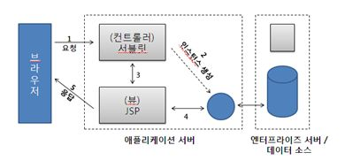

:octocat: [denlyou/Study_JavaServer](https://github.com/denlyou/Study_JavaServer)
# Servlet/JSP를 활용한 모바일 서버 프로그래밍

## Model 2 구현

### Architecture

- MVC 패턴
  - 서블릿은 Controller 역할
  - JavaBeen은 Model 역할
  - JSP는 View 역할

#### MVC의 이해
- Model은 데이터베이스의 구조를 객체로...
- View 화면에 보이는 부분 (사용자에게 보여지는 부분)
- Controller는 Business logic을 담당, M과 V의 중계
